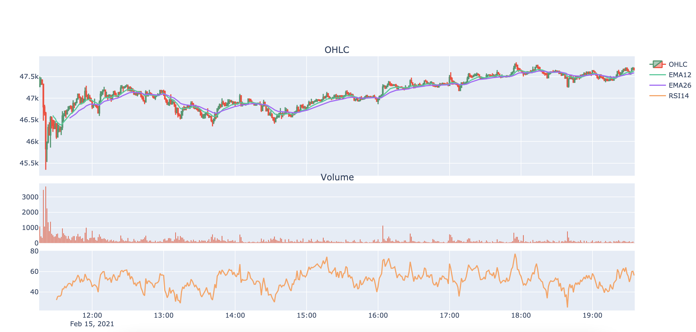

## Binance-Target Trade Bot

focus on developing
coin-targeting binance future trade bot.

# in develop!

# install
1. 가상 환경 설정
2. ta-lib 설치 https://mrjbq7.github.io/ta-lib/install.html
~~~
brew install ta-lib
~~~
3. pip install -r requirements.txt

# Current Status

## candlecrawler.py

봉 차트를 가져오고, 페이징해서 엑셀에 저장하고,
엑셀에서 불러오고, 지표등을 가공하는 모듈

## indicatorCalculator.py

차트 값을 바탕으로 지표들을 계산한다.
현재 계산 지표 : EMA, SMA, RSI, TTM

## graphdrawer.py
데이터값을 바탕으로 그래프를 그린다.
